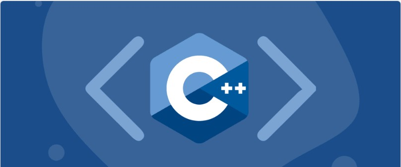

# Logica de programação com C/C++

Bem-vindos á logica de programação em c/c++!

Aqui você vai encontrar os modulos para dar inicio em estudos para á logica de programação em C/C++..

## História de linguagem C/C++  

 

O C++ foi inicialmente desenvolvido por Bjarne Stroustrup dos Bell Labs, durante a década de 1980 com o objetivo implementar uma versão distribuída do núcleo Unix. Como o Unix era escrito em C, deveria-se manter a compatibilidade, ainda que adicionando novos recursos.

## C++
C++ é uma linguagem de programação orientada a objetos muito poderosa, a qual evoluiu a partir da extensão da linguagem informática “C”, que continua sendo usada, hoje em dia, para programação estruturada de alto nível e desempenho, como sistemas operacionais, videogames e aplicativos na nuvem.

O que um programador C++ faz?
C ++ não é uma das linguagens de programação mais recentes, porém, é tão abrangente que continua sendo utilizada com sucesso para desenvolver:

# Processo em andamento!

Neste modúlo:
- Logica de programação em c/c++
- Logica de programação orientada e objeto
- desafio da calculadora
- vetores e matrizes 

# Oque resta ainda ? 

Então estou sempre atualizando esse conteúdo, ainda não está completo, tento trazer  um função á cada dia no meu repositorio, meu objetivo é ter 100 modulos em C/C++. 

## Rede socias! 

Mais informações, obrigado até a proxima!